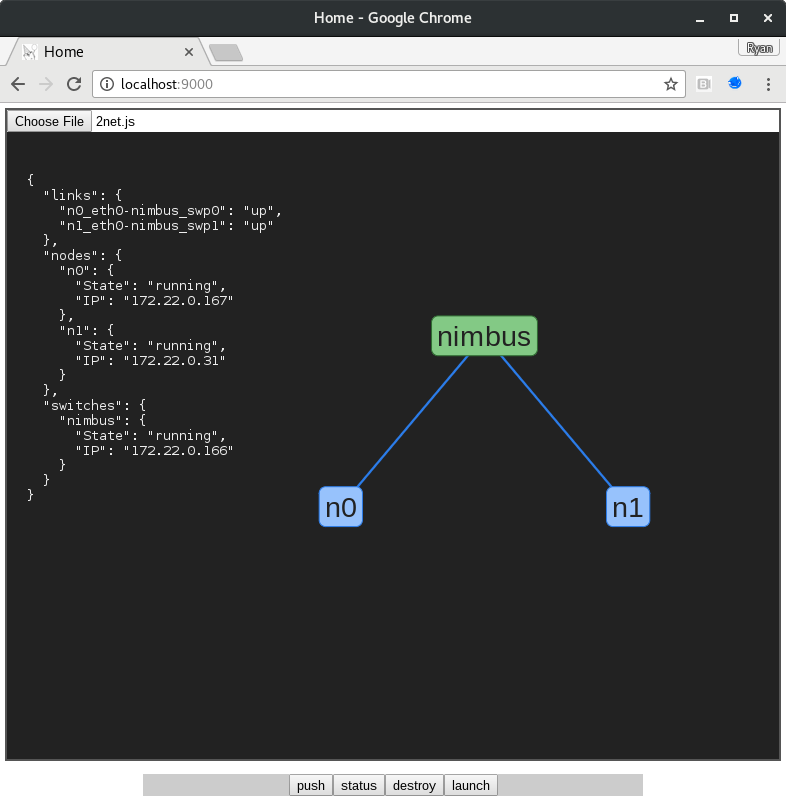

<br />
# Raven
**R**y's **A**pparatus for **V**irtual **E**ncodable **N**etworks

Raven is a tool for rapidly designing, visualizing, deploying and managing virtual networks. Raven networks are:
- designed programatically through a javascript API
- visualized and managed through a web interface
- materialized and deployed by a libvirt enabled backend with Cumulus VX virtual switches

Here is an example of a network model

```javascript
zwitch = {
  'name': 'nimbus',
  'os': 'cumulus-latest',
  'level': 1
};

nodes = Range(2).map(i => ({
  'name': `n${i}`,
  'os': 'debian-stretch',
  'level': 2
}));

nodes[0]['mounts'] = [
  {
    'source': '/home/murphy/code', 
    'point': '/opt/code'
  }
];

links = Range(2).map(i => Link(`n${i}`, 'eth0', 'nimbus', `swp${i}`));

topo = {
  'name': '2net',
  'nodes': nodes,
  'switches': [zwitch],
  'links': links
};
```
This file looks like the following when uploaded through the web interface
<br />
<br />

