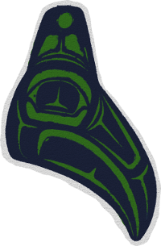

<br />
# Raven
**R**y's **A**pparatus for **V**irtual **E**ncodable **N**etworks

Raven is a tool for rapidly designing, deploying and managing virtual networks. Raven networks are:
- designed programatically through a javascript API
- managed through a command line interface
- materialized and deployed by a libvirt enabled backend

When you need more infrastructure level fidelity than a Kubernetes deployment and more programmability than a collection of Vagrantfiles, raven may be of use to you.

Here is an example of a network model

```javascript
controller = {
  'name': 'control',
  'image': 'debian-stretch', 
  'os': 'linux',
  'mounts': [{ 'source': env.SWITCHDIR, 'point': '/opt/switch-drivers'}]
}

walrus = {
  'name': 'walrus',
  'image': 'debian-stretch',
  'os': 'linux',
  'mounts': [{ 'source': env.WALRUSDIR, 'point': '/opt/walrus'}]
}

zwitch = {
  'name': 'nimbus',
  'image': 'cumulusvx-3.5',
  'os': 'linux',
  'mounts': [{ 'source': env.AGXDIR, 'point': '/opt/agx' }]
};

nodes = Range(2).map(i => ({
  'name': `n${i}`,
  'image': 'debian-stretch',
  'os': 'linux',
  'mounts': [{ 'source': env.WALRUSDIR, 'point': '/opt/walrus'}]
}));

links = [
  Link('walrus', 'eth0', 'nimbus', 'swp1'),
  Link('control', 'eth0', 'nimbus', 'swp2'),
  ...Range(2).map(i => Link(`n${i}`, 'eth0', 'nimbus', `swp${i+3}`)),
]

topo = {
  'name': '2net',
  'nodes':[controller, walrus, ...nodes],
  'switches': [zwitch],
  'links': links
};
```

## Getting started
I have tested Raven on Debian-Stretch and Ubuntu 16.04. Contributions to support other distros welcome!

### Installing

You will need at least Go 1.8 to build, and [Go's dep](https://github.com/golang/dep) package manager.  Before starting, make sure you have your $GOPATH set (if you do not we recommend: `echo "export GOPATH=~/go" >> ~/.bashrc && source ~/.bashrc`).

```shell
go get github.com/rcgoodfellow/raven
cd $GOPATH/src/github.com/rcgoodfellow/raven
./setup-ansible.sh
ansible-playbook setup.yml
```

### Building
```
dep ensure
make
```

### Tinkering
First start the raven application (you must be root due to the way we use libvirt)

```shell
sudo su
cd raven/models/2net

# grab the source code required for this model and set the mapping environment variables
source fetch.sh

# build the raven system (creates virtual machines and network descriptions)
rvn build

# deploy the virtual system
rvn deploy

# show the status of the virtual nodes
rvn status

# wait for the virtual nodes and switches to come up
rvn pingwait control walrus nimbus n0 n1

# show the status of the virtual nodes now that they are up (you will see IP addresses)
rvn status

# configure the virtual nodes and switches
rvn configure

# while configure is running, you can open up another shell window and type in
# rvn status to see how things are progressing

# run some ad-hoc config on a node
rvn ansible n1 config/n1.yml

# ssh into a node
eval $(rvn ssh walrus)
```

To run a full build, test deploy cycle run the following.

```shell
./launch.sh
```

The [launch.sh](models/2net/launch.sh) script is fairly self explanatory and concretely shows many of the capabilities of raven.


### Web Interface
Not functional at the moment until I get back to syncing the web code with the recent revamp.
